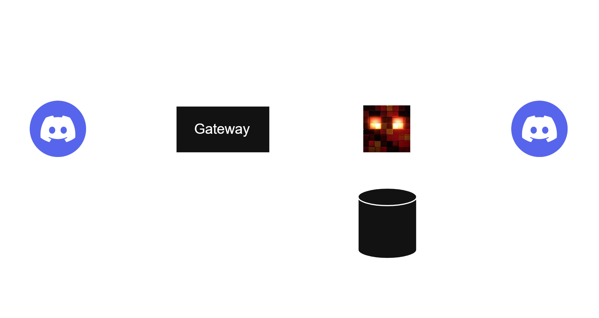

# KuudraBot
An open-source Discord bot for Kuudra in Hypixel Skyblock. It is mainly used in [Kuudra Gang](https://discord.gg/kuudra), but can be invited to other Discords and even be self-hosted!
## Features
Absolutely nothing right now.
## Development
The bot is split into two applications:
- `gateway` handles the connection to the Discord gateway and simply forwards all incoming events (commands, messages, etc.) over Redis to the worker
- `worker` contains all features, can respond to events and can access the database

Because the worker holds no persistent connection or session state, it can be restarted or replaced at any time without affecting the bot's Discord connection.


### Tech stack

| Concern | Choice |
|---|---|
| Discord REST + Gateway primitives | [`@discordjs/core`](https://www.npmjs.com/package/@discordjs/core) |
| Gateway <-> worker transport | [`@discordjs/brokers`](https://www.npmjs.com/package/@discordjs/brokers) `PubSubRedisBroker` over Redis |
| Hypixel SkyBlock data | [`hypixel-api-reborn`](https://www.npmjs.com/package/hypixel-api-reborn) |
| Database / ORM | [Prisma](https://www.prisma.io/) against Postgres |
| Logging | [Pino](https://getpino.io/) — structured JSON, secret redaction |
| Language | [TypeScript](https://www.typescriptlang.org/) |

### Setting up

First, download the required software if you don't have it. If you're on Linux you probably already have these. If you're on windows, use these commands:

```bash
winget install --id Git.Git -e
winget install --id OpenJS.NodeJS.LTS -e
winget install --id Docker.DockerDesktop -e
winget install --id Microsoft.VisualStudioCode -e # or any IDE of choice
```
When done, open Docker Desktop once to complete installation (especially of WSL if you don't use that already).

Next, create a test Discord bot [here](https://discord.com/developers/home) and a Hypixel API key [here](https://developer.hypixel.net/dashboard). Then copy the `.env.example` file, rename to `.env` and fill in your credentials. This way you don't commit your tokens to GitHub.

Next, make sure that Docker is running and start Redis, Postgres and the Gateway:

```bash
docker compose --env-file .env -f docker/docker-compose.yml -f docker/docker-compose.dev.yml up -d redis postgres gateway --build
```

Now you can start developing the `worker`:
```bash
npm run dev:worker
```

### Repository structure
All features are developed inside `apps/worker/src`. If you want, focus on just this directory and ignore everything else. If you're interested, read this:

| Path | Description |
|---|---|
| `apps/gateway/` | Discord Gateway connection + event publisher |
| `apps/worker/` | Command handlers, Hypixel API calls, DB access (community contributions live here) |
| `packages/shared/` | Shared TS types, broker topic constants, logger config |
| `docker/docker-compose.yml` | Docker services (`redis`, `postgres`, `gateway`, `worker`) |
| `docker/docker-compose.dev.yml` | Local dev overrides |
| `docker/docker-compose.prod.yml` | Production overrides |
| `scripts/healthcheck.js` | Shared container health-check script used by both Dockerfiles |
| `.github/workflows/ci.yml` | Lint, typecheck, tests, and a sandbox test on every PR |
| `.github/workflows/deploy.yml` | Builds and deploys apps/worker automatically on merge to main |
| `tsconfig.base.json` | Shared TypeScript compiler options, extended by every workspace |

### Pull request checklist

Please try to keep your PR to one specific feature and don't try to rewrite the complete worker in one PR. This makes it easier for me to review it quickly and get it deployed.

Before opening a PR, confirm:

- your feature / change is actually wanted by the Kuudra Gang community, confirm with the staff team if unsure
- your features are tested manually in your own test Discord server (screenshot/GIF in the PR description helps reviewers).
- you only modified `apps/worker`, anything else will be automatically rejected
- `npm run lint`, `npm run typecheck` and `npm test` all pass
- DB migrations (if any) are additive only

### Review & merge process

1. Open PR against `main`. `ci.yml` runs lint, typecheck and unit tests.
2. At least two maintainer approvals are required (see `CODEOWNERS`). We will try to do this as fast as possible.
3. On merge, `deploy.yml` automatically builds and rolls out the new worker image with zero downtime.

Currently, we do not accept new maintainers, but this may change in the future!